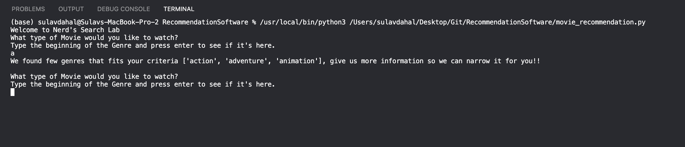
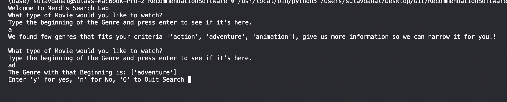
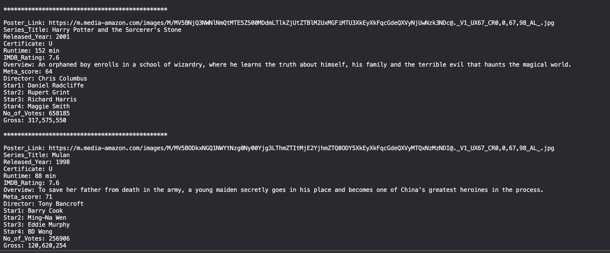

# Movie and Restaurant Recommendation Project

This projet was part of Codeacdemy's Computer Science: Data Structure & Algorithms Path. To end the module, I had to create a second portfolio project - a recommendation software.

> There are two Version of this recommendation because of the data that I utilize. Restaurant Search Utilizes the Data that was provided by Codeacdemy and Movie Search Utilizes the Data of IMDB TOP 1000 Movies downloaded from Kaggle. 

I will demonstrate the Movie Search here, however the logic behind both are same expect the Algorithms Used: 

Will Start by Prompting the User and it looks something like this:

 

It will narrow down the search until finds one, the user is looking for

 

If the User types y will show all the moveies of that Genre:

However, if the user types n, it will prompt for input From the beginning 

